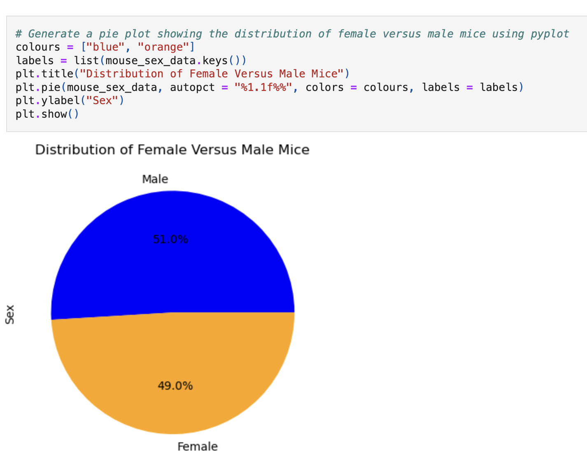

# python-visualisation-challenge
Pymaceuticals: Data Visualisation and Statistical Analysis

## Contents  
1. [Overview](#1-overview)
2. [Repository](#2-repository)
3. [Deployment ](#3-deployment)
4. [Data Analysis](#4-data-analysis) 
5. [References](#5-references)

## 1. Overview  
This challenge focuses on analysing preclinical study data from Pymaceuticals, Inc., a pharmaceutical company researching treatments for squamous cell carcinoma (SCC), a common form of skin cancer. The study involved 249 mice treated with various drug regimens over 45 days, with tumour development observed and recorded. The goal was to compare the effectiveness of the company’s drug of interest, Capomulin, against other treatments.  

As the senior data analyst, the task was to clean and process the data, conduct statistical analyses, and generate visualisations to summarise findings. Key aspects included calculating summary statistics, identifying outliers, performing correlation and regression analyses, and creating plots to effectively communicate the results. This challenge required strong skills in data manipulation, statistical interpretation, and visual storytelling using Python and Matplotlib. 

## 2. Repository  

**Jupyter Notebook** (Data analysis and visualisation)
- [`pymaceuticals.ipynb`](pymaceuticals.ipynb)

**Raw Data**  
- `data/mouse_metadata.csv`  
- `data/study_results.csv`  

## 3. Deployment

To run this challenge, ensure the following Python libraries are installed:  
- `matplotlib`  
- `pandas`  
- `scipy`  
- `numpy`  

Place the raw data files in a directory named `data` to align with the notebook's structure.  

## 4. Data Analysis

### Key Questions Answered
1. **What is the overall effect of each drug regimen?**  
   Capomulin and Ramicane demonstrated consistent tumour volume reduction. Capomulin showed a mean tumour volume of 40.7 mm³, comparable to Ramicane.  

2. **Are there outliers in the data?**  
   Capomulin had no outliers, indicating consistent performance, while other regimens showed variability.  

3. **What is the relationship between tumour size and mouse weight?**  
   A strong positive correlation (r² = 0.84) suggests heavier mice tend to have larger tumours.  

### Summary of Analysis  
- **Capomulin Performance:** Capomulin is highly effective in reducing tumour volume and demonstrates consistent results without outliers.  
- **Visualisation Techniques:** Bar charts and pie charts summarise treatment distribution, while scatter plots and regression lines illustrate tumour-weight correlations.  
- **Statistical Insights:** Quartile analysis identified potential outliers for non-Capomulin treatments, while linear regression quantified the tumour-weight relationship.  

## 5. References  

- Matplotlib documentation: [Matplotlib](https://matplotlib.org/)  
- Scipy documentation: [Scipy](https://scipy.org/)  
- Mockaroo Data Generator: [Mockaroo](https://mockaroo.com/)  
